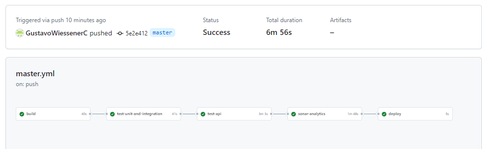
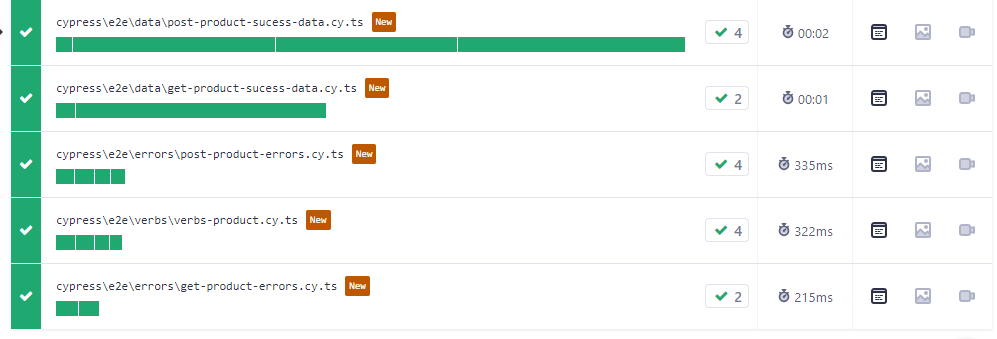
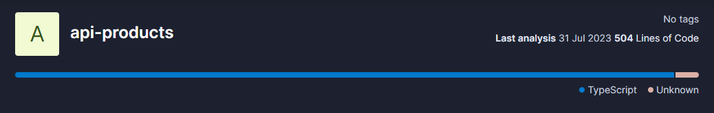

<p align="center">
  <a href="http://nestjs.com/" target="blank"></a>
</p>

## API de Gerenciamento de Produtos

Este é um projeto de API para gerenciamento de Produtos. Ele permite criar e listar produtos.

### Tecnologias utilizadas:

<b>Node.js + Nest.js + TypeORM</b>: Node.js é uma plataforma de desenvolvimento backend que permite a criação de aplicações escaláveis e de alta performance utilizando JavaScript. Nest.js é um framework para Node.js que traz uma arquitetura modular e orientada por componentes, facilitando a criação de APIs robustas e bem estruturadas. TypeORM é um ORM (Object-Relational Mapping) que facilita a integração com bancos de dados relacionais, como o PostgreSQL.

<b>PostgreSQL + ElephantSQL</b>: O PostgreSQL é um sistema de gerenciamento de banco de dados relacional de código aberto, escolhido para armazenar os dados da aplicação. O ElephantSQL é uma plataforma que oferece hospedagem e gerenciamento de bancos de dados PostgreSQL em nuvem.

<b>Cypress + Cypress Dashboard Cloud + TypeScript:</b> O Cypress é uma ferramenta de teste de ponta a ponta (end-to-end) com ele é possível criar testes automatizados que simulam as interações e integrações com serviços externos. O TypeScript é uma linguagem que adiciona tipagem estática ao JavaScript, o que ajuda a evitar erros e torna o código mais seguro e legível.

<b>Docker:</b> O Docker é uma plataforma que permite empacotar, distribuir e executar aplicações em containers, proporcionando maior portabilidade e facilidade de implantação.

<b>SonarCloud</b>: O SonarCloud é uma ferramenta de análise estática de código que ajuda a identificar e corrigir problemas de qualidade de código, tais como bugs, vulnerabilidades e código duplicados, dentre outros problemas.

<b>Render:</b> Render é uma plataforma de hospedagem que oferece infraestrutura simples e escalável para aplicações web.

### Serviços:

A API oferece os seguintes endpoints:

- POST /products/: Cria um novo Produto.
- GET /products/: Retorna a lista de todos os Produtos.

### Documentação da API:

- A API está documentada usando a especificação Swagger. Para acessar a documentação da API, acesse https://api-product-zsoa.onrender.com/api.


## Instalação

```bash
$ npm install
```

## Inicialização da aplicação:

```bash
# development
$ npm run start

# watch mode
$ npm run start:dev

# production mode
$ npm run start:prod
```

### Jobs:



<p align="center">
  <a href="https://github.com/GustavoWiessenerC/api-products/actions" target="_blank">Link para as Actions do GitHub.</a>
</p>

### Coberturas de Testing API:



<p align="center">
  <a href="https://cloud.cypress.io/projects/roxue7/runs?branches=%5B%5D&committers=%5B%5D&flaky=%5B%5D&page=1&status=%5B%5D&tags=%5B%5D&timeRange=%7B%22startDate%22%3A%221970-01-01%22%2C%22endDate%22%3A%222038-01-19%22%7D" target="_blank">Link para os resultados dos testes Cypress em Ambiente Cloud.</a>
</p>


### Métricas SonarCloud:




